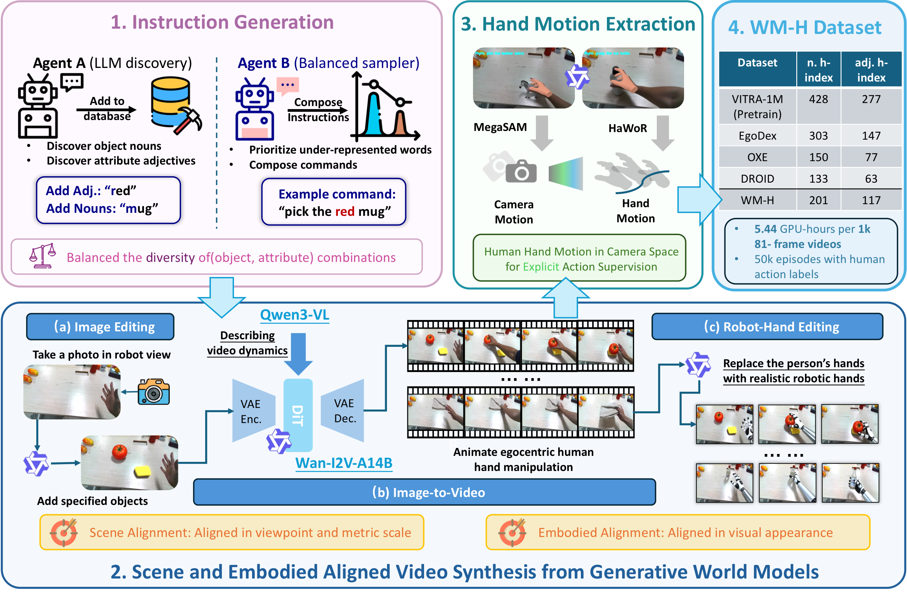

# WM-H

WM-H generates synthetic hand-centric manipulation videos for Wh0 policy training. It is the data-generation half of the repo; annotation, dataset linking, visualization, and training are launched from the repository root.

[Project page](https://chenyt31.github.io/wh0.github.io/) | Paper: coming soon



## Pipeline

```text
slot vocabulary
  -> instruction templates
  -> Qwen-Image-Edit scene image
  -> Qwen3-VL prompt augmentation
  -> Wan 2.2 I2V video
  -> optional robot-hand video edit
  -> HaWoR annotation and VITRA training tree
```

WM-H output runs are written under:

```text
WM-H/database/wm-h/instr_first/streaming_runs/<run_id>/
├── videos/
├── tasks/
├── videos_robot_hands/        # optional
├── episodic_annotations/      # created by repo-root annotation stage
└── vitra_training_data/       # created by prepare_data stage
```

Multi-GPU runs create one worker directory per GPU and the repo-root orchestrator merges them into `<run_id>_merged/` before annotation and training.

## Quick Start

From the repository root:

```bash
$EDITOR configs/project_request.yaml
bash scripts/run_all.sh --stage wmh --profile default --total-instructions 1
```

The shipped debug profile uses desktop images from `assets/debug_eval/desktop`; pass `IMAGE_DIR=/path/to/images` only when intentionally changing the source.

For FP8 Qwen3-VL, use a compatible vLLM environment and point `WMH_PYTHON` to it:

```bash
PATH=/path/to/wmh-vllm-env/bin:$PATH \
WMH_PYTHON=/path/to/wmh-vllm-env/bin/python \
CUDA_VISIBLE_DEVICES=0,1 PROFILE=default TOTAL_INSTRUCTIONS=2 BATCH_SIZE=1 \
bash scripts/run_wmh.sh
```

## GPU Profiles

| Profile | Hardware | Entry |
|---------|----------|-------|
| `default` | 1+ x 80GB | `bash scripts/run_wmh.sh` |
| `single_gpu` | 1 x 80GB conservative fallback | `bash scripts/run_all.sh --stage wmh --profile single_gpu` |

The default profile auto-uses all visible GPUs; with one visible GPU it runs one worker, and with two visible GPUs it runs two workers. Qwen3-VL FP8 and Wan stay resident by default on 80GB cards; the scene-image editor is released after its edit batch to leave headroom. The `single_gpu` profile lowers VL memory limits for debugging; enable `settings.offload_between_stages: true` in `configs/video.single_gpu.yaml` only as an OOM fallback.


## Config Files

| File | Purpose |
|------|---------|
| `configs/pipeline.yaml` | instruction generation, slot/template settings, scene image edit |
| `configs/pipeline.single_gpu.yaml` | one-GPU sequential profile |
| `configs/video.yaml` | Qwen3-VL augment and Wan I2V settings |
| `configs/video.single_gpu.yaml` | one-GPU video profile |
| `configs/video_hand_edit.yaml` | robot-hand edit with Qwen-Image-Edit Lightning LoRA |

Scene image edit and video generation intentionally use different resolutions. The shipped configs edit scene images at `768x384` for clearer objects and generate videos at `640x320`.

External WM-H model paths resolve through repo-root `weights/models/`. `tools/weights/manage_weights.py sync` creates compatibility links such as `WM-H/models -> ../weights/models`.

## Annotation and Training Data

WM-H itself creates videos. Run annotation from the repository root:

```bash
RUN_DIR=WM-H/database/wm-h/instr_first/streaming_runs/<run_id>
INPUT_PATH="$RUN_DIR" PARALLEL_K=0 WH0_DATASET_NAME=WM-H \
bash scripts/run_annotate.sh
```

Robot-hand video edit is part of the optional data path:

```bash
bash scripts/run_all.sh --stage hand_edit --input-path "$RUN_DIR/videos" --hand-edit-every-n 4
```

The hand editor reads each video's task metadata: single-hand tasks edit only the active visible hand, while bimanual tasks edit both visible hands. Build VITRA-compatible training links after annotation and optional editing. By default 20% of available videos point to `videos_robot_hands/` when edited clips exist:

```bash
bash scripts/run_all.sh --stage prepare_data --input-path "$RUN_DIR" --robot-prob 0.2
```

Build or verify annotation indices:

```bash
uv run python tools/dataset/build_episode_index.py "$RUN_DIR/episodic_annotations" --verify
uv run python tools/dataset/split_wmh_episodes.py "$RUN_DIR" --recursive
```

## Visualization

Render a full WM-H episode with MANO hand meshes:

```bash
RENDER_HAND=1 MAX_EPISODES=1 bash scripts/run_all.sh --stage visualize \
  --input-path "$RUN_DIR/vitra_training_data" \
  --output-path "$RUN_DIR/visualize_wmh_render_hand"
```

The default mode writes captioned preview videos and does not require PyTorch3D CUDA kernels. `RENDER_HAND=1` uses MANO/PyTorch3D and is the preferred check after the mesh-rendering environment is ready.

## Run Internals Manually

Use this only when debugging a specific stage:

```bash
cd WM-H
uv run python wm_h/run_instr_first.py --config configs/pipeline.single_gpu.yaml --total-instructions 8
uv run python wm_h/video_prompt_preparer.py --config configs/video.single_gpu.yaml
uv run python wm_h/run_video_generator.py --config configs/video.single_gpu.yaml
bash scripts/run_video_hand_edit.sh
```

For normal use, prefer repo-root `scripts/run_all.sh` and `scripts/run_from_config.sh`.
