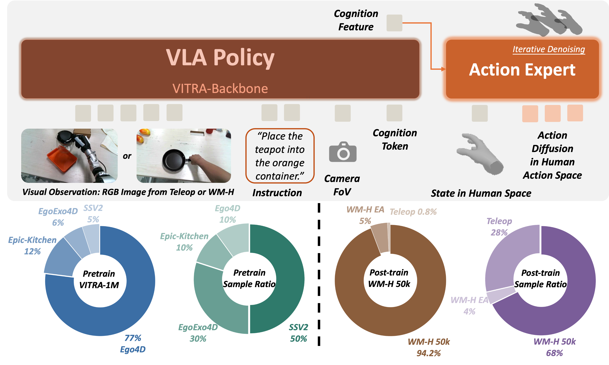

# vitra-wh0

`vitra-wh0` contains the Wh0 policy stack built on top of [VITRA](https://github.com/microsoft/VITRA). Use the repository root for setup, weights, WM-H data preparation, and validation; use this directory when debugging VITRA internals.

[Project page](https://chenyt31.github.io/wh0.github.io/) | Paper: coming soon



## Role in the Workflow

```text
prepared WM-H / G1 data
  -> dataset indices
  -> VITRA train/eval config
  -> policy training
  -> human-hand prediction / evaluation videos
```

Wh0 additions relative to upstream VITRA:

- WM-H fine-tuning config: `vitra/configs/robot_finetune_wmh.json`
- debug G1 smoke config: `vitra/configs/robot_finetune_debug.json`
- Wh0/G1 dataset loaders under `vitra/datasets/`
- repo-root hand reconstruction through `libs/hand_recon/`
- repo-root wrappers for training, visualization, and evaluation

## Setup

From the repository root:

```bash
CUDA_EXTRA=auto WH0_EXTRAS=policy,annotation,dev bash scripts/setup.sh
bash scripts/run_from_config.sh weights
bash tools/validation/validate_environment.sh runtime
```

The tested policy-training stack is `torch==2.6.0+cu124`. Annotation needs a matching `torch-scatter` wheel. Mesh visualization with `RENDER_HAND=1` also needs PyTorch3D built for the local GPU architecture; the default visualization path does not require it.

## Data Requirements

Training configs expect dataset indices before training starts:

- G1 data: `training_index.npz`
- WM-H / human episodic annotations: `episode_frame_index.npz`

The G1 dataset used by Wh0 is collected with Unitree's
[`xr_teleoperate`](https://github.com/unitreerobotics/xr_teleoperate) stack on a
G1 + Inspire hand platform. Clone it under `vitra-wh0/thirdparty/` when you need
to replay, collect, or deploy on the robot:

```bash
cd vitra-wh0/thirdparty
git clone https://github.com/unitreerobotics/xr_teleoperate.git
```

Build them from the repository root:

```bash
uv run python tools/dataset/build_g1_index.py <g1_dataset_root> --verify
uv run python tools/dataset/build_episode_index.py <episodic_annotations_dir> --verify
```

For WM-H runs, the usual prepared tree is:

```text
<run_id>"/vitra_training_data/
├── Video/WM-H_root/
├── Annotation/WM-H/episodic_annotations/
├── Annotation/WM-H/episode_frame_index.npz
└── wmh_training_manifest.json
```

Create it with:

```bash
bash scripts/run_all.sh --stage prepare_data --input-path <wmh_run_dir> --robot-prob 0.2
```

## Training

Run from the repository root:

```bash
bash scripts/run_all.sh --stage train --task finetune
```

Or from this directory:

```bash
bash scripts/run_robot_wmh_finetune.sh
```

Useful 100-step smoke test. The debug config trains on `assets/debug_eval/g1_dataset`; copy it and set `save_final_checkpoint=true` when you want to save the final checkpoint.

```bash
WANDB_MODE=disabled CUDA_VISIBLE_DEVICES=0 NPROC_PER_NODE=1 \
CONFIG=vitra/configs/robot_finetune_debug.json \
bash ../scripts/run_train.sh \
  --max_steps 100 \
  --batch_size 1 \
  --total_batch_size 1 \
  --num_workers 0
```

The default WM-H fine-tuning recipe is `vitra/configs/robot_finetune_wmh.json`: PaliGemma2-3B + DiT-B action head, bf16, frozen vision encoder, robot loss, and `WM-H_50k` data mix. `WM-H_50k` loads WM-H with weight `1.0` and `g1_dataset` with weight `0.4`. In `full_pipeline`, WM-H is first materialized with robot-hand edited clips selected at 20% probability, then G1 is symlinked into the same training tree and the run-local config is written to `<wmh_run_dir>/vitra_training_config.json`.

Edit `vitra/configs/robot_finetune_wmh.json` for real dataset roots, checkpoint paths, batch size, and training schedule outside the generated-run smoke workflow.

## Visualization

From the repository root:

```bash
RENDER_HAND=1 MAX_EPISODES=1 bash scripts/run_all.sh --stage visualize \
  --input-path <wmh_run_dir>/vitra_training_data \
  --output-path <wmh_run_dir>/visualize_wmh_render_hand

RENDER_HAND=1 WHOLE_EPISODE=1 NUM_SAMPLES=1 bash scripts/run_all.sh --stage visualize \
  --input-path assets/debug_eval/g1_dataset \
  --output-path validation_outputs/g1_render_hand_episode
```

## Inference and Evaluation

Run the preset evaluation wrapper:

```bash
CKPT="$(pwd)/outputs/vitra/vitra_wmh_finetune/checkpoints/<run>/checkpoints/<ckpt>/weights.pt"
CFG="$(pwd)/outputs/vitra/vitra_wmh_finetune/checkpoints/<run>/config.json"
RUN_DIR="$(pwd)/WM-H/database/wm-h/instr_first/streaming_runs/<run_id>"

bash ../scripts/run_eval_pipeline.sh annotation_default \
  --mode annotation \
  --video-path "$RUN_DIR/videos/<video>.mp4" \
  --annotation-npy "$RUN_DIR/episodic_annotations/<annotation>.npy" \
  --config "$CFG" \
  --model-path "$CKPT" \
  --statistics-path "$(pwd)/weights/statistics/dataset_statistics.json" \
  --output-dir "$(pwd)/validation_outputs/pred_vs_gt_wmh" \
  --output-videos-dir "$(pwd)/validation_outputs/pred_vs_gt_wmh"
```

The evaluation wrapper writes a prediction video, a GT render, and a side-by-side `*_pred_vs_gt.mp4`. Use `--mode dataset --root-dir ../assets/debug_eval/g1_dataset` for G1 samples and `--mode annotation --video-path ... --annotation-npy ...` for WM-H samples.

Single-image human prediction:

```bash
IMAGE_PATH=/path/to/image.jpg \
INSTRUCTION='Left hand: None. Right hand: pick up the cup.' \
CONFIG_PATH=vla_checkpoint/<run>/config.json \
bash ../scripts/run_human_inference.sh
```

Module-level entrypoint for debugging:

```bash
uv run python -m vitra.tools.human_prediction_pipeline --mode annotation \
  --video-path <video> \
  --annotation-npy <npy> \
  --frame-idx 0 \
  --config <config.json>
```

## G1 + Inspire Deployment

Deployment is split into a policy server and a robot client:

- `deployment/model_server.py` runs on the GPU workstation. It loads VITRA/Wh0,
  receives camera frames and 24-D robot state, returns `wh0_robot_action`
  trajectories, and writes visualization videos to
  `validation_outputs/deployment/` unless `--video_path` is set.
- `deployment/client.py` runs on the G1 control machine. It imports Unitree arm,
  Inspire hand, image streaming, and XR helpers from
  `thirdparty/xr_teleoperate`, captures head-camera frames, calls the server,
  and executes the returned wrist poses and Inspire joint commands.

Install/clone prerequisites:

```bash
cd vitra-wh0/thirdparty
git clone https://github.com/unitreerobotics/xr_teleoperate.git
```

Start the model server on the workstation:

```bash
uv run python vitra-wh0/deployment/model_server.py \
  --config_path outputs/vitra/vitra_wmh_finetune/checkpoints/<run>/config.json \
  --model_path outputs/vitra/vitra_wmh_finetune/checkpoints/<run>/checkpoints/<ckpt>/weights.pt \
  --statistics_path weights/statistics/dataset_statistics.json \
  --host 0.0.0.0 \
  --port 8765
```

Start the G1/Inspire client on the robot-side machine:

```bash
export WH0_ROOT="$(pwd)"
export XR_TELEOPERATE_ROOT="$(pwd)/vitra-wh0/thirdparty/xr_teleoperate"
uv run python vitra-wh0/deployment/client.py \
  --server-ip <workstation-ip> \
  --server-port 8765 \
  --arm G1_29 \
  --img-server-ip <g1-image-server-ip> \
  --instruction "Left hand: None. Right hand: pick the black kettle."
```

Use `--mock-robot` for network and model-server checks without commanding the
robot. Use `--debug-dir validation_outputs/deployment/client_debug` only when
you want to save latest camera frames.

## Key Weights

Weights are managed from the repository root under `weights/`:

```text
weights/checkpoints/vitra-vla-3b.pt
weights/hawor/checkpoints/hawor.ckpt
weights/hawor/external/detector.pt
weights/MANO_RIGHT.pkl
weights/models/google/paligemma2-3b-mix-224
```

Run `bash scripts/download_weights.sh` from the repository root to link or download configured items.

## Upstream VITRA

For original architecture details, dataset format, checkpoints, and citation, see:

- [microsoft/VITRA](https://github.com/microsoft/VITRA)
- [VITRA project page](https://microsoft.github.io/VITRA/)
- [VITRA-1M dataset](https://huggingface.co/datasets/VITRA-VLA/VITRA-1M)

If you use VITRA components, cite the upstream VITRA paper.
